# いろいろなトッププレートの作り方

キーボードの打鍵感、見た目の大きな要素であるトッププレート。  
自作キーボード設計というと回路設計をしないと思い込んでいる方も多いのですが、
回路設計は手段であり、目的は快適にコンピュータと意思疎通を図ることです。

スイッチ位置さえ固定できれば手配でもオリジナル配列のキーボードは作れますし、
手前味噌ではありますが、無限の可能性があれば若干楽になるかもしれません。  
とにかくトッププレートさえ設計できればあなたのオリジナルキーボードは完成したもも同然です。(暴走)  

今回は回路設計できない人向けに、PCB、アクリル、3Dプリントの各トッププレートの作り方を伝授します。  
既にキーボード設計している人でも**今まで作ったことのない素材**でトッププレートを作ってみたり、
すでに所有している(とくにソケットの)キーボードのトッププレートを**再設計してお着替え**なんかのきっかけになれば幸いです。

## PCBプレート

早速ではございますが、ここで一つ断っておきます。  
回路設計の必要はありませんが、Kicadはめちゃくちゃ使います！  
Inkscapeで設計してたときもあるのですが、mmとinchが入り乱れるキーボード設計では、Kicadのグリッドが一番ラクでした…  
そんな都合でまずいちばん手間が少ないPCBプレートの作り方を伝授します。

### 手順

1. Kicadをインストールして「01.pcb/sample.kicad_pcb」を開いてください。
2. スイッチやネジ穴、外形を好きな感じに並び替えて、足りなければコピペしてください。

完了です。笑

「alt+3」で3Dビューアが起動します

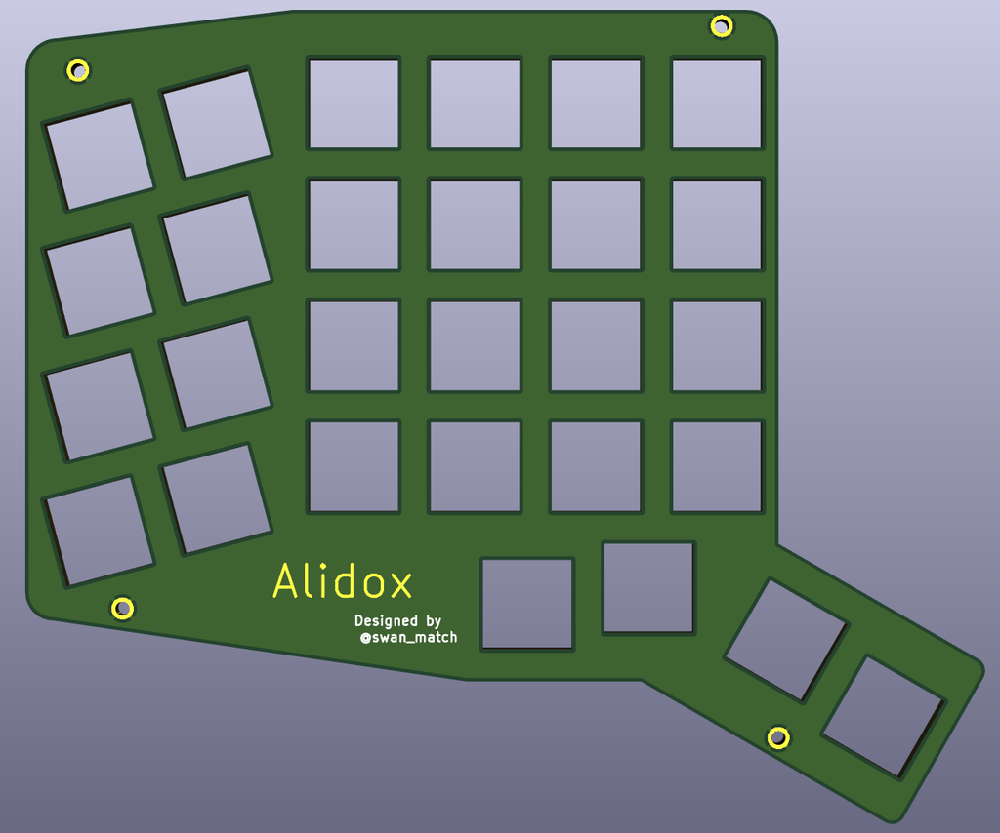

ベタとかシルクとかマスクとかはお好みで。(^^)b  
ネジ穴はEdge.cutsでもいいですが、スルーホールにするとメッキされてちょっとキレイです。

じつは基板データが公開されている既存のキーボードでも、
スイッチのフットプリントを↑に置き換えて、余分なものを消せばトッププレートになります。

あとは製造会社のご指定の方法でガーバーってのをプロットしてお金払って到着を待ちます。

発注先はElecrowさん、JLCPCBさん、ALLPCBさんなどがあります。

## レーザー加工データ

レーザー加工データはInkscapeで作りますが、まずネジ穴を外形(Edge.cutsレイヤー)に移すため、同じ位置にEdge.cutsレイヤーに半径1.1mmの円を作成します。(置き換えたのが「02.svg/sample/sample.kicad_pcb」)  
Kicadで「ファイル->エクスポート->SVG」でEdge.cutsレイヤーをエクスポートして、Inkscapeに読み込んでください。  
キャンパスのサイズ、線の太さや色などを業者さん指定の方法に従って変更し完了です。
簡単ですね。

彫刻などはお好みで。

発注先はElecrowさん、Emerge+さん、遊舎工房さんなどがあります。

## 3Dモデリング

3Dトッププレートは爪問題も解消できるし、
サンドイッチプレートの隙間も埋めれます。  
デメリットは設計が面倒なのと量産に向かないことです。

モデリングソフトは界隈だとFusion360も多い印象ですが、
OS宗教上の理由でBlenderを使います。  
(Fusion360がLinuxで使えるようになってほしい)

### Blender雑チートシート

まずはblenderの簡単な操作方法をまとめます。

* モード切替: Tab
  * オブジェクトモード: オブジェクトの選択、オブジェクト全体に対する操作
  * 編集モード: 選択したオブジェクトの各頂点、辺、面を操作

* 視点切替
  * 7: 上から
  * 1: 左から
  * 3: 前から
  * Ctrl+7: 下から
  * Ctrl+1: 右から
  * Ctrl+3: 後から
  * 5: 遠近法切替

* 選択系:
  * 右クリック: 選択
  * Ctrl+tab: 選択モード切替(頂点、辺、面)
  * a: 全選択/選択解除
  * c: 範囲選択
  * l: 隣接選択
  * Alt+右クリック: ループ選択(直接つながっている)
  * Ctrl+Alt+右クリック: リング選択(平行を選択)

* 編集系:
  * g: 移動
  * f: 面張り
  * e: 押出
  * s: 拡大縮小
  * r: 回転
  * del: 削除・融解
  * k: ナイフ
  * b: ベゼル(角丸)

* 表示系:
  * h: 選択物を非表示
  * alt+h: すべて表示
  * z: スケルトン切替
  * t: 左側のやつ(ツールシェルフ)
  * n: 右側のやつ

* その他:
  * alt+c: カーブ(SVG読んだあと)をメッシュに変更
  * ctrl+j: 複数オブジェクトを結合
  * ctrl+p: 別オブジェクトを分割

書いてて思ったけど、これ専用のキーボードほしいな。そのうち作ろ。

### ブーリアントラブルシュート

メッシュ同士の結合(AND)、差分(OR)などをしてくれるとっても便利なブーリアンモデファイ。  
とっても便利だけどとっても癖っぽい。  
キーボードにおいてはプレートからスイッチをくり抜いたり、ネジ穴を開けたりするのに使います。  
うまくいかない原因はたいてい法線の向きが揃っていないか、頂点や辺や面が接していることが原因。

法線というのは雑に言うと面の裏表。  
人間目線で明らかでもBlenderからみて裏表がどっちかわからなくなるとくり抜いたりくっつけたりできない。

* ↓はうまくくり抜けない  
  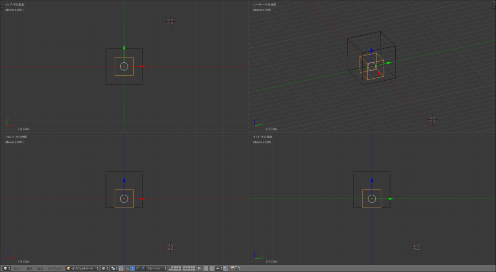
* ↓こうするとくり抜ける
  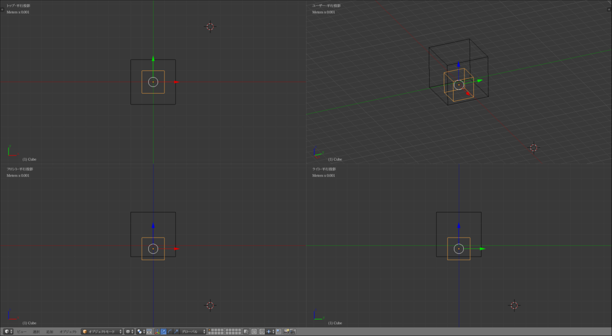

### 手順

1. ファイルメニューからKicadからエクスポートしたSVGをインポートします。  
  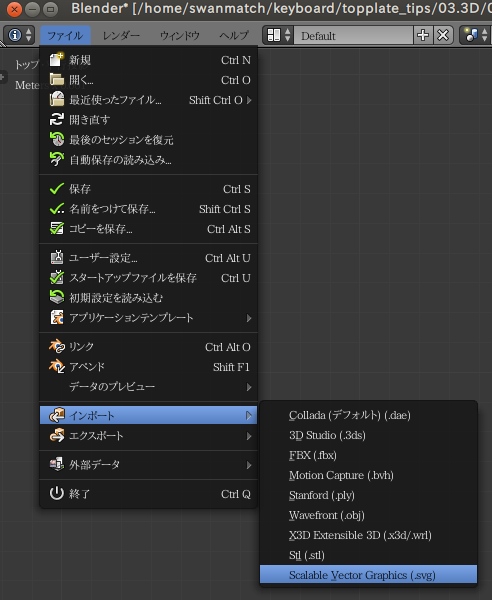
2. 縮小されて取り込まれているので、10000倍に拡大(s→10000)します。  
  
3. すべて選択(a)してメッシュに変更(alt+c)し、結合(ctrl+j)します。  
  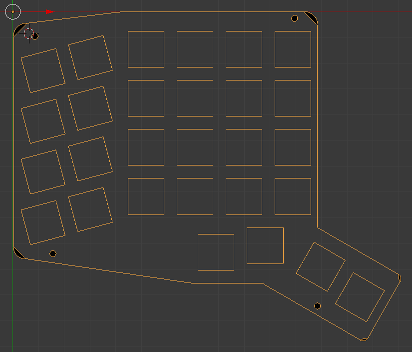
4. まず編集モードに切替え(tab)、 複数の面で構成されているネジ穴を一つの面にまとめます(f)。  
  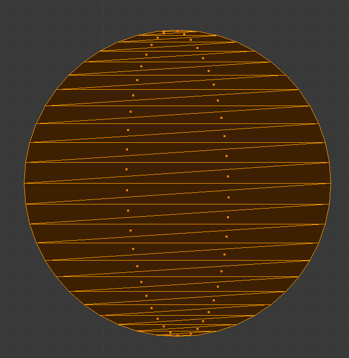
  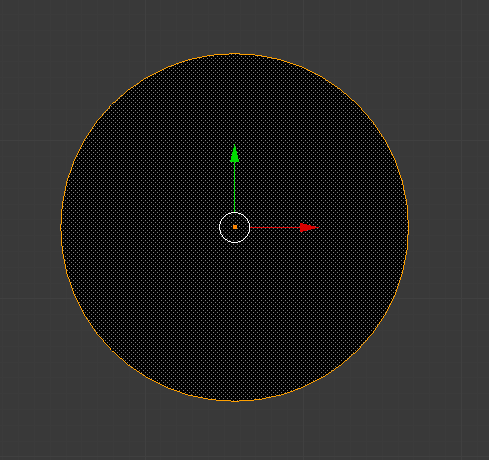
5. スイッチ、ネジ穴をそれぞれループ選択(alt+右クリック)し、別オブジェクトに分割(p)します。適当な名前つけとくといいです。  
  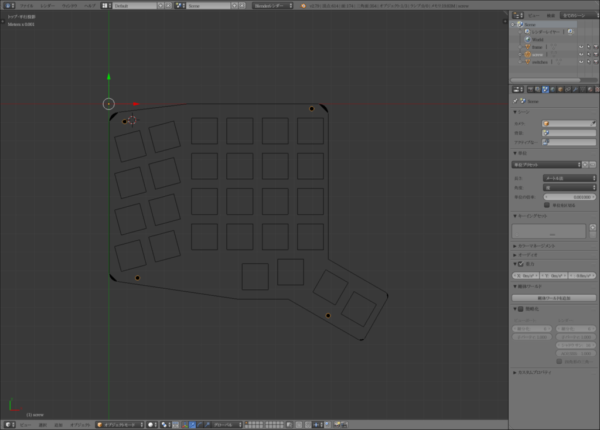
6. 円弧は既に面張りされているので、面選択モード(ctrl+tab)で全選択(a)して、面のみ削除(del)し、残った斜辺を削除(del)ます。  
  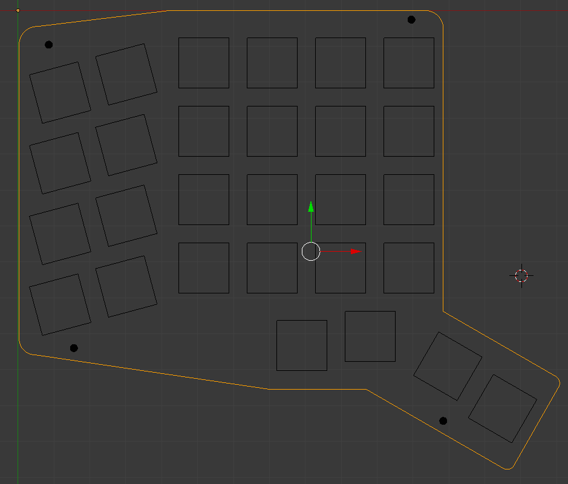
7. 頂点選択モード(ctrl+tab)で全選択して面張り(f)します。形状的に面が交差してしまう場合は複数回に分けて面張りし、最後に面を融解(del)するといいです。  
  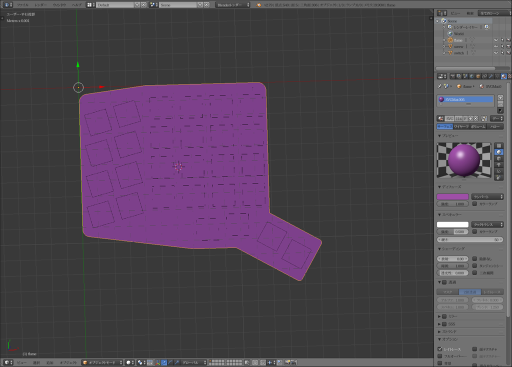
8. 作成した面を5mm押し出します(e→5)  
  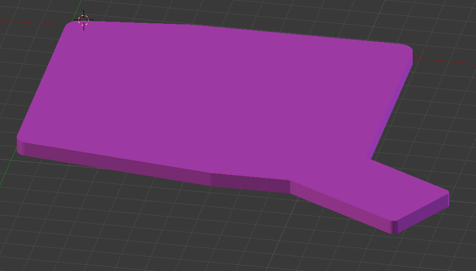
9. さきほど別オブジェクトに分割したスイッチ外形の編集モードに入り、最終的にブーリアンでくり抜くため、すべての頂点をz軸方向に-1mm移動(g→z→-1)し、各スイッチで面張り(f)し、ツールシェルフから法線方向を**下**に揃え、7mm押し出します(e→7)  
  もし余裕があれば各スイッチで爪用の溝を0.5mmくらい作っておくと保持性が高まっていいです。
  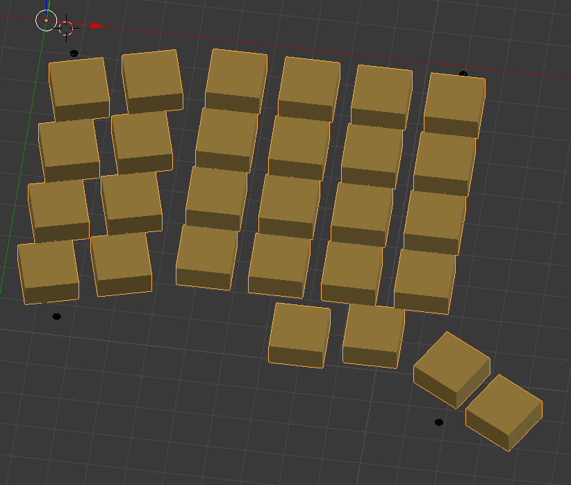
10. ネジ外形の編集モードに入り、すべての頂点をZ軸方向に6mm移動(g→z→6)し、法線方向を**上**に揃え、3mm押し出します(e→3)  
11. ピポットポイントをそれぞれの原点にして、0mmで押出し(e→enter)、1.8倍(スペーサーが入る太さ)に拡大(s→1.8)し、更に4mm押出し(e→4)ます。  
  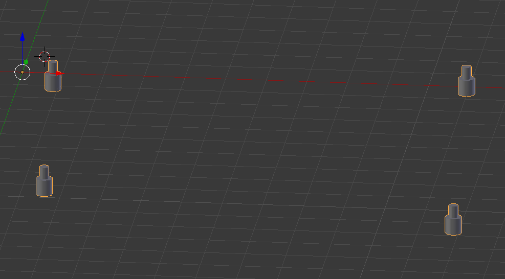
12. せっかく3Dなので、上部の辺をループ選択して、丸みをつけ(ctrl+b)ます。(ツールシェルフ(t)で微調整可)  
  
13. メインのプレートのブーリアンモデファイでネジとスイッチをくり抜き、適用し、利用したスイッチ外形とネジ外形のオブジェクトを削除(del)します。  
  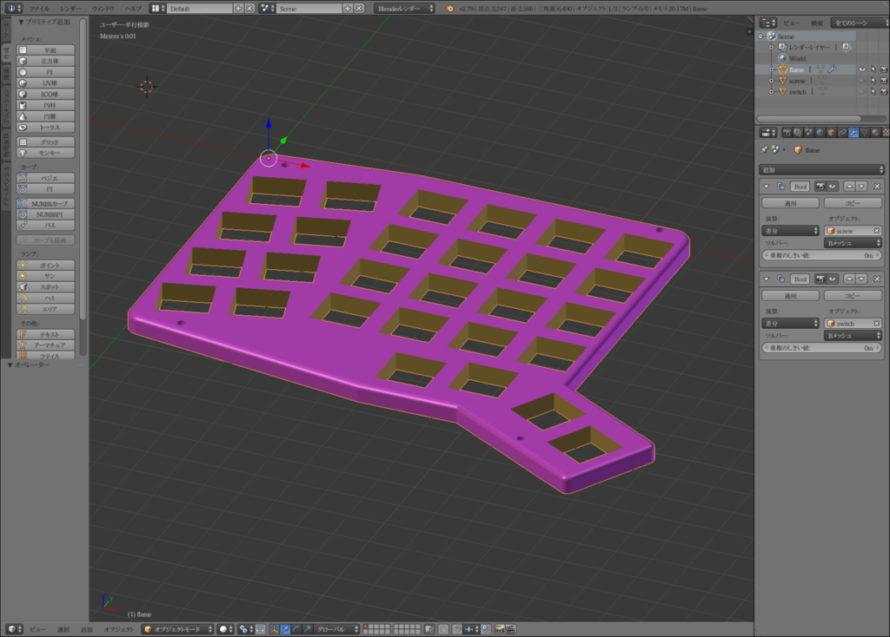
14. ファイルメニューからSTLにエクスポートしておしまい。

他に比べると面倒に感じるかもしれませんが、慣れれば爪の溝を作っても1時間くらいの作業です。  
途中適当なタイミングで色や名前をつけたり、重複頂点を削除したりとかした気がするけどどこでやったか忘れました。

3Dプリンタをお持ちでないかたは3Dhubs、DMM.makeなどに発注すると2週間ほどで届きます。

Hack Your Input!

